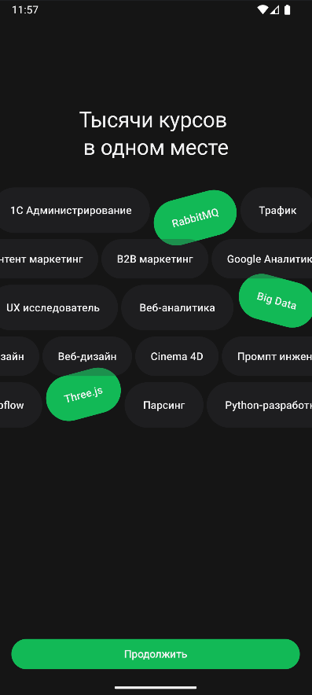
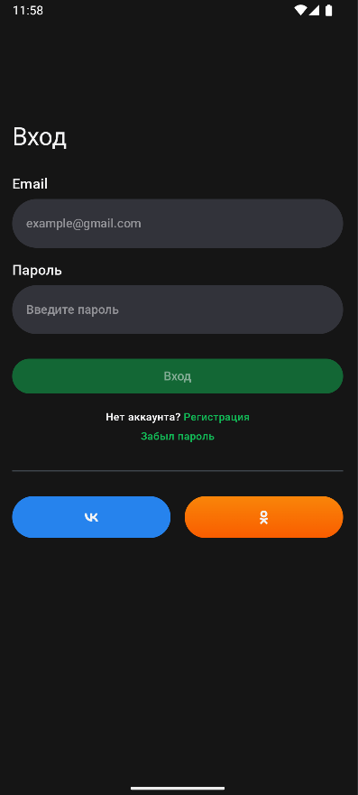
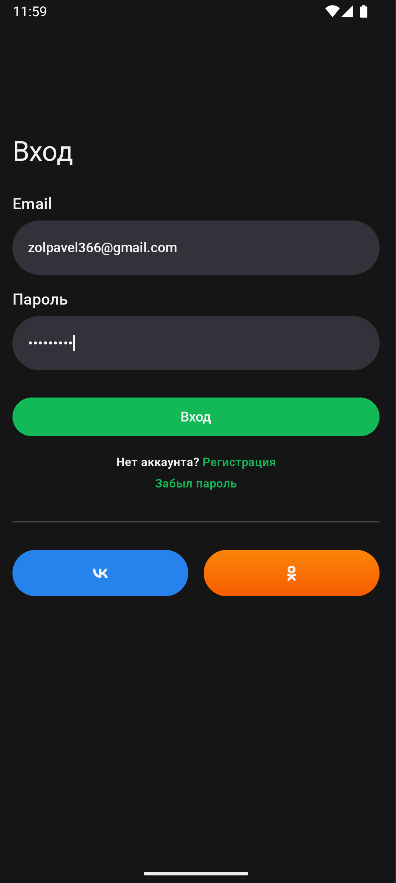
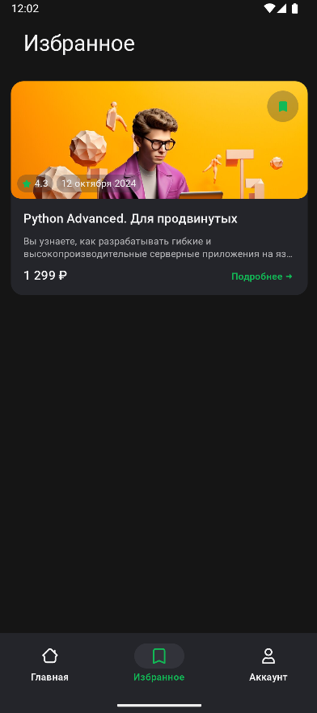
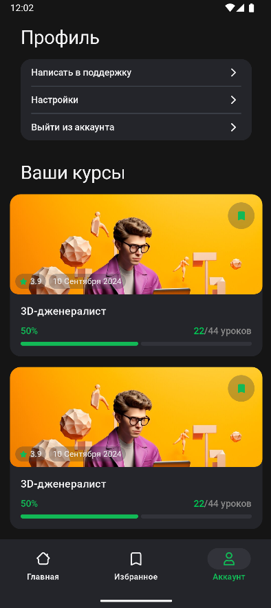

# IT Courses App

## Описание
Приложение **IT Courses App** — это мобильное приложение для Android, 
предназначенное для отображения списка IT-курсов с возможностью добавления их в избранное.
Проект разработан в соответствии с техническим заданием и макетами в Figma. 
Данные о курсах загружаются из предоставленного API, 
а избранные курсы сохраняются локально в базе данных.

Основные функции:
- Авторизация по email и паролю с валидацией.
- Отображение списка курсов с данными из API.
- Сортировка курсов по дате публикации.
- Добавление/удаление курсов в избранное с сохранением в локальной базе данных.
- Просмотр избранных курсов
- Переход в браузер по кнопкам соцсетей (ВКонтакте, Одноклассники).

## Макеты и API
- **Макеты**: [Figma](https://www.figma.com/design/QXrKYWsCf6cwXTj8rDfTMD/%D0%A2%D0%B5%D1%81%D1%82%D0%BE%D0%B2%D0%BE%D0%B5-%D0%B7%D0%B0%D0%B4%D0%B0%D0%BD%D0%B8%D0%B5-IT-%D0%BA%D1%83%D1%80%D1%81%D1%8B?node-id=0-1&t=kpw92aQ0tvmWPYYh-1)
- **Мок API**: [JSON](https://drive.usercontent.google.com/u/0/uc?id=15arTK7XT2b7Yv4BJsmDctA4Hg-BbS8-q&export=download)

## Требования
- **Платформа**: Android.
- **Рекомендуемый стек технологий**:
    - Kotlin
    - Retrofit
    - Coroutines, Flow
    - Koin
    - MVVM, Clean Architecture
    - Многомодульность
    - Jetpack Compose
    - Room

## Установка
1. **Клонируйте репозиторий**:
   ```bash
   git clone https://github.com/VopRos-ZP/Courses.git
   ```
2. **Откройте проект** в Android Studio.
3. **Синхронизируйте зависимости**.

## Экраны
### Экран Onboarding


### Экран авторизации
#### Не валидные поля


#### Валидные поля


- **Поле Email**: Ввод по маске `текст@текст.текст`, кириллица недоступна.
- **Поле Пароль**: Любые символы.
- **Кнопка входа**: Активна только при корректно заполненных полях. При нажатии осуществляется переход на главный экран.
- **Кнопки "Регистрация" и "Забыл пароль"**: Неактивны.
- **Кнопки соцсетей**:
    - ВКонтакте: Переход в браузер на `https://vk.com/`.
    - Одноклассники: Переход в браузер на `https://ok.ru/`.

### Главный экран


- **Поиск и фильтр**: Нефункциональные элементы, хардкод.
- **Список курсов**: Данные загружаются из API (`courses` массив). Поля:
    - `id`: Идентификатор курса.
    - `title`: Заголовок.
    - `text`: Описание (обрезается, если не умещается в 2 строки).
    - `price`: Цена.
    - `rate`: Рейтинг.
    - `startDate`: Дата начала.
    - `hasLike`: Признак избранного (зеленая заливка при `true`).
    - `publishDate`: Дата публикации.
- **Сортировка**: По клику на кнопку сортировки курсы сортируются по убыванию `publishDate`.
- **Избранное**:
    - Пользователь может добавить/удалить курс в избранное.
    - Данные сохраняются локально в Room.
    - Просмотр избранных курсов доступен в разделе "Избранное".

### Избранное


### Аккаунт


## Структура проекта
Проект организован по принципам **Clean Architecture** с многомодульной структурой:
- **app**: Основной модуль приложения.
- **data**: Работа с API и локальной базой данных (Retrofit, Room).
- **domain**: Бизнес-логика, use cases.
- **presentation**: UI (Compose, ViewModel).

